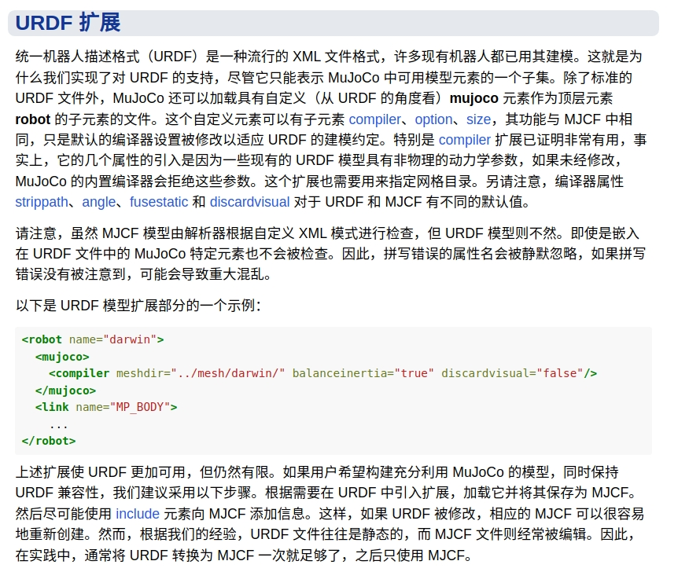

# EasyMJCF
> 暂时只适用于Linux

> **URDF 一键转换为 MJCF**


## Usage

>**确保传入SW导出的源文件，除非你知道自己在干啥**

```
#用于简化STL
pip install open3d

cd src

python main.py <URDF文件地址>

python main.py ../resource/Wheelleg_2024/urdf/Wheelleg_2024.urdf
```

## Pipeline
- 读取URDF文件并获取文件名
- 在link同级添加mujoco编译选项
- 替换所有的package为相对路径
- 调用compile进行编译
- 如果超过面数限制进行简化，直到合适为止（暂时最小倍率0.1）
- 在xml中添加scene引用
- 创建mjcf文件夹并复制文件

## Test
确保已安装mujoco

```
simulate ../resource/Wheelleg_2024/mjcf/Wheelleg_2024.urdf.xml
```

## Resource

当然你也可以不依赖脚本自行替换编译

### 修改源文件
mujoco编译选项

```
<!-- mujoco compiler insert -->
<!-- 添加在与link同级下 -->

<mujoco>
    <compiler 
    meshdir="../meshes/"    <!-- STL目录 -->
    balanceinertia="true"   <!-- 惯量设置 -->
    discardvisual="false"   <!-- 视觉特征 -->
    fusestatic="false"/>    <!-- 设置base_link -->
</mujoco>

```


替换 ```package://Wheelleg_2024(你导出的名称)```为```..```

### 编译

使用```src/scripts/compile```下的```compile```“编译”urdf文件为xml

```
./compile <urdf文件地址> <xml文件地址>
```

> 此过程和完成上一步骤就将urdf拖进mujoco并使用save xml原理一样！
> 
> 本
### 简化STL 

如果编译过程中报面数过多错误就使用```src/scripts/mashlab```中的```simplify_stl.py```进行简化

```
python simplify_stl.py <输入目录> <输出目录> <压缩率(0.0~1.0)>
```
自行调整压缩率以适应要求，直到可以完成编译

### 场景配置
可以在urdf同级创建一个mjcf目录
并把```src/resource```中的```scene.xml```和你刚才导出的xml复制到mjcf目录

并在机器人的xml文件中添加场景引用

```
<include file="scene.xml"/>
```


scene环境配置

```
<mujocoinclude>

<statistic center="0 0 0.1" extent="0.8"/>

<visual>
<headlight diffuse="0.6 0.6 0.6" ambient="0.3 0.3 0.3" specular="0 0 0"/>
<rgba haze="0.15 0.25 0.35 1"/>
<global azimuth="-130" elevation="-20"/>
</visual>

<asset>
<texture type="skybox" builtin="gradient" rgb1="0.3 0.5 0.7" rgb2="0 0 0" width="512" height="3072"/>
<texture type="2d" name="groundplane" builtin="checker" mark="edge" rgb1="0.2 0.3 0.4" rgb2="0.1 0.2 0.3" markrgb="0.8 0.8 0.8" width="300" height="300"/>
<material name="groundplane" texture="groundplane" texuniform="true" texrepeat="5 5" reflectance="0.2"/>
</asset>

<worldbody>

<light pos="0 0 1.5" dir="0 0 -1" directional="true"/>
<geom name="floor" pos="0 0 -0.5" size="0 0 0.01" type="plane" material="groundplane"/>
</worldbody>
</mujocoinclude>

```

### 浮动关节
```
<worldbody>
    <body name="base_link" pos="0 0 0">

    <!-- base_link 浮动关节 -->
        <freejoint name="floating_base"/>   <!-- 复制这一行，如果需要的话 -->

```

## Reference

- [mujoco #urdf-extensions](https://docs.mujoco.cn/en/stable/modeling.html#urdf-extensions)



- [zhihu 华北舵狗王 ](https://zhuanlan.zhihu.com/p/699075829)
 
- compile 源文件
  https://mujoco.org/download/mujoco210-linux-x86_64.tar.gz